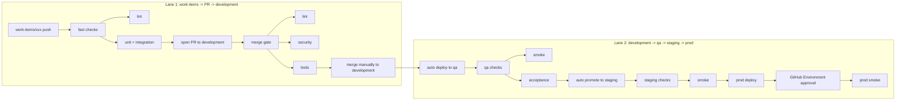

# CI/CD and Environments

## Goal

- [x] Define the delivery pipeline, the environment-specific Docker image strategy, and the test gates that control promotion from local development to QA, staging, and production.

## Scope

- Multi-stage Docker image strategy shared across environments.
- Environment-specific execution flow for linting, automated tests, and manual QA.
- Promotion rules from CI to QA to staging to production.
- Explicit handoff points for exploratory QA findings and regression fixes.
- Separation of caches and runtime artifacts by environment and purpose.

## Implementation Tasks

### Environment Model

- [x] Confirm the environment map: `local/dev`, `ci/test`, `qa`, `staging`, and `prod`.
- [x] Confirm the image stages: `dev`, `test`, `qa`, `staging`, and `prod`.
- [x] Document which artifacts are immutable and promoted between environments.

### CI Gates

- [x] Define the earliest lint gate and keep it single-pass.
- [x] Define the automated test bundle for push and pull request events.
- [x] Define which tests are required before a QA deploy.

### QA Flow 

- [x] Define the automated QA deploy step.
- [x] Define the manual QA signoff step.
- [x] Define the exploratory failure handback path to development.

### Staging Flow

- [x] Define the promotion rule from QA to staging.
- [x] Define the staging smoke checks that run after deploy.
- [x] Define the release-readiness criterion for staging.

### Production Flow

- [x] Define the production promotion rule from staging.
- [x] Define the minimal production runtime image constraints.
- [x] Define the post-deploy smoke validation for production.

### Artifact and Cache Rules

- [x] Define how compiled assets are rebuilt for each promoted artifact.
- [x] Define which caches stay environment-scoped.
- [x] Define which tooling must never reach the `prod` image.

## Environment Map

| Environment | Primary Purpose | Image Stage | Notes |
| --- | --- | --- | --- |
| `local/dev` | Developer loop and hot reload | `dev` | Uses live reload and local editing flow. |
| `ci/test` | Automated validation on push/PR | `test` | Runs the fast automated suite. |
| `qa` | Controlled automated deploy and manual QA | `qa` | Receives promoted artifacts after CI passes. |
| `staging` | Final manual signoff before production | `staging` | Receives the QA-approved artifact for release validation. |
| `prod` | Production runtime | `prod` | Minimal runtime image, no test or dev tooling. |

## Pipeline Matrix

### Local Development

- `standardrb` or equivalent linting may be run manually or via a fast pre-push hook.
- `make test/unit` covers unit specs.
- `make test/integration` covers contracts, integration, and request specs.
- `make test/smoke` covers smoke specs.
- `make test/acceptance` covers cucumber acceptance specs.
- `make test/performance` covers performance specs.
- Full smoke, acceptance, and mutation testing remain optional locally unless explicitly requested.

### Two-Lane Flow

- [ ] `push` to `work-items/*` runs fast checks only.
- [ ] A green `push` opens or updates the PR to `development`.
- [ ] `pull_request` to `development` runs the merge gate checks.
- [ ] A green PR is merged manually into `development`.
- [ ] Merge into `development` triggers the automated `qa` deploy.
- [ ] A green `qa` promotes automatically to `staging`.
- [ ] A green `staging` promotes to `prod` with GitHub Environment approval.
- [ ] `prod` runs smoke validation after approval.

### Branch Push and Pull Request

- Run linting once at the earliest CI stage.
- Run fast automated test coverage: unit, contracts, integration, and request tests.
- Use the `test` image stage for deterministic test execution via `make test/ci`.
- Avoid re-running the same lint step in later stages unless a new artifact requires it.

### QA Deployment

- Deploy the CI-approved artifact to `qa`.
- Require lint, `make test/ci`, Brakeman, Bundler Audit, and Importmap audit before promotion.
- Run post-deploy smoke tests automatically with `make test/smoke`.
- Run selected acceptance scenarios automatically when practical with `make test/acceptance`.
- Require manual QA validation after the automated gates pass.
- Document exploratory findings, even when the failure is outside the scripted suite.

### Staging Deployment

- Promote only after QA signs off manually.
- Use the same build artifact that passed QA, or an immutable promoted digest from the same commit.
- Run a smaller post-deploy smoke suite if needed with `make test/smoke`.
- Treat staging as the final release readiness environment before production.

### Production Deployment

- Promote only the staging-approved artifact.
- Keep the runtime image minimal.
- Skip test and dev dependencies in the final image.
- Prefer smoke-only post-deploy validation with `make test/smoke`.

## Artifact Rules

- Never rely on stale compiled assets.
- Build assets from the current commit for each promoted artifact.
- Keep test and runtime caches separate by purpose and environment.
- Do not carry `node_modules`, test gems, or dev-only tooling into `prod`.
- Use Docker multistage builds to keep each runtime image minimal.

## QA Handback

- If QA finds a defect, capture the scenario and evidence in the project tracker.
- Move the ticket back to the development state with the documented failure.
- Add or update automated coverage before re-promoting the fix.
- Re-run the relevant automated checks before QA revalidation.

## Validation

- [x] The pipeline map is explicit for each environment and image stage.
- [x] Linting is defined as a single-pass early gate.
- [x] QA has a documented automated deploy plus manual signoff path.
- [x] Staging has a documented promotion rule from QA.
- [x] Production has a documented minimal-image and smoke-only validation policy.
- [x] QA handback documents how defects return to development.

## Related Docs

- `docs/work-items/001-bootstrap-and-environment.md`
- `docs/work-items/002-testing-foundation.md`
- `docs/work-items/004-frontend-toolchain.md`
- `docs/overview.md`

## Notes

- Keep `qa` and `staging` separate on purpose: QA validates the automated pipeline and exploratory findings, staging validates manual signoff on the promoted release artifact.
- Linting should run once in the earliest sensible pipeline stage, not be repeated at every hop.
- Automatic test execution should happen when the pipeline reaches its intended stage, not manually in ad hoc commands.
