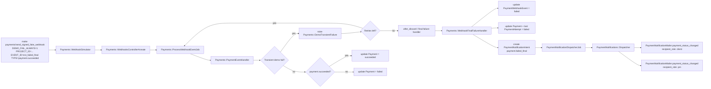

# Payment Final Failure Notifications

## Goal

- [ ] Notify client and PM when a payment fails after all technical retries are exhausted, and provide a reproducible make-based demo for that final-failure path.

## Scope

- Keep retry attempts finite and explicit.
- Treat webhook retries as technical retries, not user-visible payment attempts.
- Emit a final failure notification only after retries are exhausted.
- Include a normalized failure reason when the provider supplies one.
- Preserve the existing success path and per-attempt business notifications.

## Exact Flow



## Planned Models

- `PaymentAttempt`
- `PaymentWebhookEventAttempt`
- `PaymentWebhookEvent`
- `PaymentNotificationIntent`
- `Payment`

## Planned Mailers

- `PaymentNotificationMailer`

## Planned Services

- `Payments::WebhookSimulator`
- `Payments::ProcessWebhookEventJob`
- `Payments::WebhookFinalFailureHandler`
- `Payments::FailureReasonNormalizer` or equivalent domain helper
- `PaymentNotifications::Dispatcher`
- `PaymentNotifications::EmailChannel`

## Make Task

- Desired demo command:

```bash
DEMO_FAIL_ALWAYS=1 make payments/send_signed_fake_webhook PROJECT_ID=<project_id> EVENT_ID=evt_failed_final TYPE=payment.succeeded
```

## Implementation Plan

- [ ] Add a bounded retry strategy for `Payments::ProcessWebhookEventJob`.
- [ ] Add a final failure handler that runs when retries are exhausted.
- [ ] Normalize payment failure reasons into stable codes with a raw fallback.
- [ ] Create `payment.failed_final` notification intents on final failure.
- [ ] Send role-specific client and PM emails for final failure.
- [ ] Extend the webhook simulator/task to support a deterministic always-fail demo.
- [ ] Add specs for the final-failure path, including retry exhaustion and email delivery.

## Expected Result

- The payment ends in a terminal failed state after retries are exhausted.
- The final failure email is sent exactly once to the client and PM.
- The email includes a normalized reason when available, otherwise `unknown_error`.

## Notes

- Do not send one email per technical retry.
- Do send one user-visible notification once the payment is irrecoverably failed.
- Keep the current success and transient-failure behavior unchanged.
