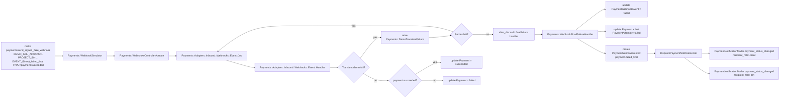

# Payment Final Failure Notifications

## Goal

- [ ] Notify client and PM when a payment fails after all technical retries are exhausted, and provide a reproducible make-based demo for that final-failure path.

## Scope

- Keep retry attempts finite and explicit.
- Treat webhook retries as technical retries, not user-visible payment attempts.
- Emit a final failure notification only after retries are exhausted.
- Include a normalized failure reason when the provider supplies one.
- Preserve the existing success path and per-attempt business notifications.

## Current Codebase

- Webhook ingestion already flows through `Payments::Adapters::Inbound::Webhooks::Event::Job` and `Payments::Adapters::Inbound::Webhooks::Event::Handler`.
- The handler layer already splits success and failure handling in `Succeeded` / `Failed` handlers.
- Retry behavior is currently hardcoded in the job and does not yet use `Payments::Domain::Policies::RetryPolicy`.
- The payment notification pipeline already exists via `PaymentNotificationIntent`, `DispatchPaymentNotificationJob`, and `PaymentNotificationMailer`.
- `PaymentWebhookEvent` already stores raw failure fields, but it does not yet expose a stable normalized failure-code column.
- Demo support currently covers `DEMO_FAIL_ONCE` only.

## Exact Flow



## Planned Models

- Existing: `PaymentWebhookEventAttempt`, `PaymentWebhookEvent`, `PaymentNotificationIntent`, `Payment`
- Needed: a stable normalized failure-code field on `PaymentWebhookEvent` or an equivalent value object persisted with the event

## Planned Mailers

- `PaymentNotificationMailer`

## Planned Services

- `Payments::Adapters::Outbound::Webhooks::WebhookSimulator`
- `Payments::Adapters::Inbound::Webhooks::Event::Job`
- `Payments::Adapters::Inbound::Webhooks::Event::Handler`
- `Payments::Adapters::Inbound::Webhooks::Event::Handler::Succeeded`
- `Payments::Adapters::Inbound::Webhooks::Event::Handler::Failed`
- `Payments::WebhookFinalFailureHandler`
- `Payments::FailureReasonNormalizer` or equivalent domain helper
- `Payments::Application::Handlers::DispatchPaymentNotificationJob`

## Design Notes

- Reuse the existing payment notification pipeline instead of introducing a new dispatcher layer.
- Keep the final-failure flow separate from the normal success and transient-failure paths.
- Persist a stable failure code for reporting, but keep the raw exception/message for diagnostics.
- Trigger the final-failure notification once, only after retry exhaustion.

## Make Task

- Desired demo command:

```bash
DEMO_FAIL_ALWAYS=1 make payments/send_signed_fake_webhook PROJECT_ID=<project_id> EVENT_ID=evt_failed_final TYPE=payment.succeeded
```

## Implementation Plan

- [x] Add a bounded retry strategy for `Payments::Adapters::Inbound::Webhooks::Event::Job`.
- [x] Add a final failure handler that runs when retries are exhausted.
- [x] Normalize payment failure reasons into stable codes with a raw fallback.
- [x] Create `payment.failed_final` notification intents on final failure.
- [x] Send role-specific client and PM emails for final failure.
- [ ] Extend the webhook simulator/task to support a deterministic always-fail demo.
- [ ] Add specs for the final-failure path, including retry exhaustion and email delivery.

## Expected Result

- The payment ends in a terminal failed state after retries are exhausted.
- The final failure email is sent exactly once to the client and PM.
- The email includes a normalized reason when available, otherwise `unknown_error`.

## Affected Docs

- `docs/work-items/033-payment-webhook-ingestion.md`
- `docs/work-items/034-payment-event-handler-pipeline.md`
- `docs/work-items/035-payment-retry-and-observability.md`
- `docs/work-items/039-payment-outbound-notifications.md`
- `docs/work-items/040-payment-invoice-generation-and-storage.md`

## Affected Ops

- `app/domains/payments/adapters/inbound/webhooks/event/`
- `app/domains/payments/adapters/outbound/webhooks/`
- `app/domains/payments/application/handlers/`
- `app/domains/payments/domain/entities/`
- `app/views/payments/adapters/outbound/email/`
- `lib/tasks/`
- `spec/unit/`
- `spec/mailers/`

## Notes

- Do not send one email per technical retry.
- Do send one user-visible notification once the payment is irrecoverably failed.
- Keep the current success and transient-failure behavior unchanged.
- Prefer the smallest change that adds final-failure behavior to the existing pipeline.
