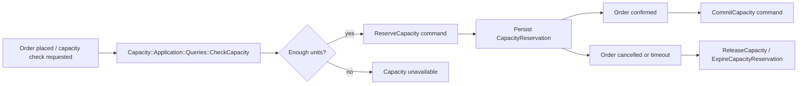

# Capacity Reservation Workflow

## Goal

- [x] Model the production capacity lifecycle so orders can reserve, commit, release, and expire capacity with explicit application commands and tests.

## Scope

- Keep capacity as a separate domain package.
- Make reservation lifecycle explicit instead of hiding it inside availability checks.
- Keep `CheckCapacity` as the read/query entrypoint, but add write-side commands for reservations.
- Support the basic lifecycle:
  - reserve
  - commit
  - release
  - expire
- Keep the current catalog/ordering integration stable while the reservation workflow is introduced.

## Current Codebase

- `Capacity::Domain::Aggregates::ProductionCapacity` already tracks total and reserved units.
- `Capacity::Domain::Policies::CapacityCalculationPolicy` already computes availability from `Ordering::Adapters::Persistence::Order::OrderRecord`.
- `Capacity::Application::Queries::CheckCapacity` already exposes the query-side check.
- `Capacity::Adapters::Inbound::ScheduledJobs::CheckCapacityJob` and `Capacity::Adapters::Outbound::Catalog::CatalogReader` already exist as thin entrypoints.
- `Capacity::Adapters::Inbound::EventConsumers::ProjectCapacityConsumer` is still a placeholder.
- `app/domains/capacity/application/commands/` is empty, so the write-side workflow is not modeled yet.
- `app/domains/capacity/package_todo.yml` still tracks a dependency violation in the application ports.

## Exact Flow

## Planned Models

- Existing: `ProductionCapacity`, `CapacityReservation`, `CapacityPeriod`
- Needed: repository-backed write model for reservations and reservation state transitions

## Planned Commands

- `Capacity::Application::Commands::ReserveCapacity`
- `Capacity::Application::Commands::CommitCapacity`
- `Capacity::Application::Commands::ReleaseCapacity`
- `Capacity::Application::Commands::ExpireCapacityReservation`

## Planned Services

- `Capacity::Application::Queries::CheckCapacity`
- `Capacity::Adapters::Inbound::ScheduledJobs::CheckCapacityJob`
- `Capacity::Adapters::Inbound::EventConsumers::ProjectCapacityConsumer`
- `Capacity::Adapters::Outbound::Catalog::CatalogReader`

## Design Notes

- Keep the query side simple and deterministic.
- Put reservation lifecycle rules in the domain, not in jobs or catalog adapters.
- Reuse the existing capacity aggregate and policies before introducing new abstractions.
- Prefer explicit reservation state transitions over implicit counters or background heuristics.

## Implementation Plan

- [x] Add reservation commands and their domain/application boundaries.
- [x] Model reserve/commit/release/expire transitions on the capacity aggregate.
- [x] Persist reservation lifecycle changes in the capacity repository.
- [x] Wire the ordering integration to call the new write-side commands.
- [x] Add specs for availability, reservation lifecycle, and expiration behavior.

## Expected Result

- Orders can reserve capacity before confirmation.
- Confirmed orders commit capacity, cancelled/expired ones release it.
- Availability checks remain fast and query-oriented.

## Affected Docs

- `docs/work-items/041-application-boundaries-and-repositories.md`
- `docs/work-items/042-order-workflow-orchestration.md`
- `docs/work-items/044-order-domain-and-project-rename.md`

## Affected Ops

- `app/domains/capacity/domain/`
- `app/domains/capacity/application/`
- `app/domains/capacity/adapters/`
- `app/domains/ordering/`
- `spec/unit/domains/capacity/`
- `spec/unit/domains/ordering/`

## Checklist

- [x] Capacity has an explicit reservation workflow.
- [x] Query-side availability remains isolated from write-side reservation logic.
- [x] Reservation expiry is modeled as a first-class domain action.
- [x] Ordering integration uses the capacity application layer, not direct persistence.

## Validation

- [x] Specs cover capacity availability.
- [x] Specs cover reservation transitions.
- [x] Specs cover commit/release/expire behavior.
- [x] No new package dependency violations are introduced.

## Notes

- Start with the reservation lifecycle before optimizing storage or scheduling.
- Keep the existing capacity calculation policy as the source of availability truth until the reservation model proves otherwise.
